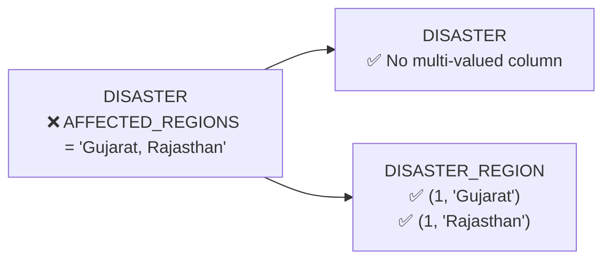
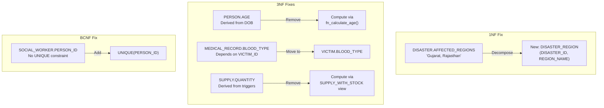

# Normalization Analysis — DisasterReliefDB

## Verdict

> The current schema is **mostly in 2NF** but has specific violations that prevent it from reaching 3NF. It can be normalized up to **BCNF (Boyce-Codd Normal Form)** with the changes described below. After those fixes, 4NF and 5NF are also satisfied.

---

## Current Status Per Normal Form

| Normal Form | Status | Issues Found |
|-------------|--------|-------------|
| **1NF** | ❌ Violated | 1 violation |
| **2NF** | ✅ Satisfied | No partial dependencies (after 1NF fix) |
| **3NF** | ❌ Violated | 3 violations |
| **BCNF** | ❌ Violated | 1 violation |
| **4NF** | ✅ Satisfied | No multi-valued dependencies (after fixes) |
| **5NF** | ✅ Satisfied | No join dependencies |

---

## 1NF Violations (Atomic Values)

> **Rule**: Every column must hold atomic (indivisible) values. No repeating groups or multi-valued fields.

### Violation 1: `DISASTER.AFFECTED_REGIONS`

```sql
-- CURRENT (violates 1NF):
DISASTER(DISASTER_ID, TYPE, SEVERITY, AFFECTED_REGIONS, AGENCY_ID)
-- Example row: (1, 'Earthquake', 'High', 'Gujarat, Rajasthan', 1)
--                                         ^^^^^^^^^^^^^^^^^^^^
--                                         MULTI-VALUED! Not atomic.
```

`AFFECTED_REGIONS` stores **comma-separated values** like `'Gujarat, Rajasthan'` or `'Odisha, Andhra Pradesh'`. This is a multi-valued attribute crammed into a single column.

**Fix — Create a junction table:**

```sql
-- AFTER (1NF compliant):

-- Remove AFFECTED_REGIONS from DISASTER
ALTER TABLE DISASTER DROP COLUMN AFFECTED_REGIONS;

-- New table to store regions per disaster
CREATE TABLE DISASTER_REGION (
    DISASTER_ID INT,
    REGION_NAME VARCHAR(100) NOT NULL,
    PRIMARY KEY (DISASTER_ID, REGION_NAME),
    FOREIGN KEY (DISASTER_ID) REFERENCES DISASTER(DISASTER_ID)
);

-- Old: (1, 'Earthquake', 'High', 'Gujarat, Rajasthan', 1)
-- New:
--   DISASTER: (1, 'Earthquake', 'High', 1)
--   DISASTER_REGION: (1, 'Gujarat'), (1, 'Rajasthan')
```



---

## 2NF Check (Partial Dependencies)

> **Rule**: No non-key attribute should depend on only **part** of a composite primary key.

2NF only applies to tables with **composite primary keys**. Let me check each:

| Table | Primary Key | Non-Key Attributes | Partial Dependency? |
|-------|------------|-------------------|-------------------|
| `VICTIM_DIETARY_RESTRICTIONS` | `(VICTIM_ID, RESTRICTION_TYPE)` | *None* | ✅ No non-key attributes exist |
| `LOCATION_SUPPLY` | `(LOCATION_ID, SUPPLY_ID)` | `QUANTITY_STORED` | ✅ Depends on full key |
| `VENDOR_SUPPLY` | `(VENDOR_ID, SUPPLY_ID)` | *None* | ✅ No non-key attributes exist |
| `VICTIM_SUPPLY` | `(VICTIM_ID, SUPPLY_ID)` | `QUANTITY_ALLOCATED`, `ALLOCATION_DATE` | ✅ Both depend on full key |

All other tables have single-column PKs → 2NF is automatically satisfied.

> **Result: ✅ The schema satisfies 2NF.** No partial dependencies found.

---

## 3NF Violations (Transitive Dependencies)

> **Rule**: No non-key attribute should depend on **another non-key attribute**. Every non-key attribute must depend **directly and only** on the primary key.

### Violation 1: `PERSON.AGE` — Derived from `DOB`

```
Functional Dependency Chain:
  PERSON_ID → DOB → AGE
              ^^^    ^^^
              non-key depends on non-key = TRANSITIVE DEPENDENCY
```

`AGE` is **computed from** `DOB`. It is not an independent fact — it changes every year and can always be derived via `TIMESTAMPDIFF(YEAR, DOB, CURDATE())`. Storing it redundantly means:
- It goes stale (a person's stored age becomes wrong after their birthday)
- It creates a transitive dependency: `PERSON_ID → DOB → AGE`

> [!NOTE]
> The database already has `fn_calculate_age(DOB)` in `routines.sql` to compute this dynamically, which confirms `AGE` is derived.

**Fix — Remove the derived column:**

```sql
-- AFTER (3NF compliant):
ALTER TABLE PERSON DROP COLUMN AGE;

-- Compute age dynamically in queries:
SELECT *, fn_calculate_age(DOB) AS AGE FROM PERSON;

-- Or use a VIEW:
CREATE VIEW PERSON_WITH_AGE AS
SELECT *, fn_calculate_age(DOB) AS AGE FROM PERSON;
```

---

### Violation 2: `MEDICAL_RECORD.BLOOD_TYPE` — Depends on VICTIM, not the Record

```
Functional Dependency Chain:
  RECORD_NUMBER → VICTIM_ID → BLOOD_TYPE
                  ^^^^^^^^^    ^^^^^^^^^^
                  non-key depends on non-key = TRANSITIVE DEPENDENCY
```

`BLOOD_TYPE` is a **biological property of the victim**, not of a medical record. It doesn't change between medical visits. Storing it in every medical record means:
- **Data redundancy**: A victim with 3 medical records has `BLOOD_TYPE` stored 3 times
- **Update anomaly**: Correcting a blood type requires updating ALL of that victim's records
- **Transitive dependency**: `RECORD_NUMBER → VICTIM_ID → BLOOD_TYPE`

**Fix — Move BLOOD_TYPE to the VICTIM table:**

```sql
-- AFTER (3NF compliant):

-- Add to VICTIM (where it logically belongs)
ALTER TABLE VICTIM ADD COLUMN BLOOD_TYPE VARCHAR(5);

-- Remove from MEDICAL_RECORD
ALTER TABLE MEDICAL_RECORD DROP COLUMN BLOOD_TYPE;
```

Before vs After:

```
BEFORE:
  MEDICAL_RECORD: (1, victim=3, blood='A-', 'Morphine...', 'Surgery...', '2026-01-17', worker=1)
  MEDICAL_RECORD: (3, victim=3, blood='A-', 'Physio...',   'Follow-up',  '2026-01-25', worker=2)
                                ^^^^^^^^^^                                               
                                REPEATED for same victim!

AFTER:
  VICTIM: (3, ..., blood_type='A-', ...)          ← stored ONCE
  MEDICAL_RECORD: (1, victim=3, 'Morphine...', 'Surgery...', '2026-01-17', worker=1)
  MEDICAL_RECORD: (3, victim=3, 'Physio...',   'Follow-up',  '2026-01-25', worker=2)
```

---

### Violation 3: `SUPPLY.QUANTITY` — Redundant Derived Column

```
SUPPLY.QUANTITY = SUM(LOCATION_SUPPLY.QUANTITY_STORED) - SUM(VICTIM_SUPPLY.QUANTITY_ALLOCATED)
```

`QUANTITY` in the `SUPPLY` table is **not an independent fact** — it's a running total maintained by the trigger `trg_update_global_supply_stock` and manual `UPDATE` statements in the Java DAO. The true source of truth is the `LOCATION_SUPPLY` and `VICTIM_SUPPLY` tables.

This creates:
- **Data redundancy**: The same information exists in two places
- **Consistency risk**: If the trigger fails or is bypassed, `SUPPLY.QUANTITY` goes out of sync

> [!WARNING]
> This is a **denormalization-for-performance** decision. Removing `QUANTITY` is the normalized approach, but it means every stock check requires an aggregate query. This is a trade-off you should evaluate.

**Fix (strict 3NF) — Remove and compute dynamically:**

```sql
-- AFTER (3NF compliant):
ALTER TABLE SUPPLY DROP COLUMN QUANTITY;

-- Drop the trigger (no longer needed)
DROP TRIGGER trg_update_global_supply_stock;

-- Compute stock dynamically via a VIEW:
CREATE VIEW SUPPLY_WITH_STOCK AS
SELECT 
    s.SUPPLY_ID,
    s.ITEM_NAME,
    s.TYPE,
    s.EXPIRY_DATE,
    COALESCE(ls.total_stored, 0) - COALESCE(vs.total_allocated, 0) AS QUANTITY
FROM SUPPLY s
LEFT JOIN (
    SELECT SUPPLY_ID, SUM(QUANTITY_STORED) AS total_stored 
    FROM LOCATION_SUPPLY GROUP BY SUPPLY_ID
) ls ON s.SUPPLY_ID = ls.SUPPLY_ID
LEFT JOIN (
    SELECT SUPPLY_ID, SUM(QUANTITY_ALLOCATED) AS total_allocated 
    FROM VICTIM_SUPPLY GROUP BY SUPPLY_ID
) vs ON s.SUPPLY_ID = vs.SUPPLY_ID;
```

---

## BCNF Check (Boyce-Codd Normal Form)

> **Rule**: Every **determinant** (left side of a functional dependency) must be a **candidate key**.

### Violation: `SOCIAL_WORKER.PERSON_ID` — Non-unique Determinant

```sql
SOCIAL_WORKER(EMPLOYEE_ID PK, PERSON_ID FK, SPECIALISATION, WORK_SHIFT)
```

`PERSON_ID` **functionally determines** `SPECIALISATION` and `WORK_SHIFT` (since one person can only be one worker), but it is NOT declared as a candidate key (no `UNIQUE` constraint). This means we have:

```
PERSON_ID → SPECIALISATION, WORK_SHIFT    (FD exists)
PERSON_ID is NOT a candidate key           (no UNIQUE constraint)
```

This violates BCNF because a non-key attribute is acting as a determinant.

**Fix — Add a UNIQUE constraint:**

```sql
ALTER TABLE SOCIAL_WORKER ADD CONSTRAINT uq_worker_person UNIQUE (PERSON_ID);
```

This makes `PERSON_ID` a candidate key, satisfying BCNF. No structural change needed — just a missing constraint.

---

## 4NF and 5NF

After the above fixes:

- **4NF** (no multi-valued dependencies): ✅ Satisfied. The `VICTIM_DIETARY_RESTRICTIONS` table already correctly decomposes the multi-valued dietary attribute. The new `DISASTER_REGION` table does the same for affected regions.
- **5NF** (no join dependencies not implied by candidate keys): ✅ Satisfied. No table can be further losslessly decomposed.

---

## Summary of All Changes



### Change-by-Change Table

| # | Table | Change | Normal Form Fixed | Impact |
|---|-------|--------|-------------------|--------|
| 1 | `DISASTER` | Remove `AFFECTED_REGIONS` column | **1NF** | Need new `DISASTER_REGION` table |
| 2 | *(new)* `DISASTER_REGION` | Create `(DISASTER_ID, REGION_NAME)` | **1NF** | Junction table for multi-valued regions |
| 3 | `PERSON` | Remove `AGE` column | **3NF** | Use `fn_calculate_age(DOB)` or a view |
| 4 | `MEDICAL_RECORD` | Remove `BLOOD_TYPE` column | **3NF** | Move to `VICTIM` table |
| 5 | `VICTIM` | Add `BLOOD_TYPE VARCHAR(5)` column | **3NF** | Blood type stored once per victim |
| 6 | `SUPPLY` | Remove `QUANTITY` column | **3NF** | Compute via aggregate view |
| 7 | `SUPPLY` *(trigger)* | Drop `trg_update_global_supply_stock` | **3NF** | No longer needed |
| 8 | `SOCIAL_WORKER` | Add `UNIQUE(PERSON_ID)` constraint | **BCNF** | Enforces 1:1 person-to-worker mapping |

---

## What's Already Well-Normalized ✅

The schema gets a lot right — these aspects are already properly normalized:

| Aspect | Pattern Used | NF Satisfied |
|--------|-------------|-------------|
| Multi-valued dietary restrictions | Decomposed into `VICTIM_DIETARY_RESTRICTIONS` | 1NF ✅ |
| Person subtype/supertype | Shared-key inheritance (PERSON → VICTIM/INQUIRER/WORKER) | 3NF ✅ |
| Many-to-many relationships | Junction tables (`VENDOR_SUPPLY`, `LOCATION_SUPPLY`, `VICTIM_SUPPLY`) | 2NF ✅ |
| No repeating groups | Every column is single-valued (except `AFFECTED_REGIONS`) | 1NF (mostly) ✅ |
| Composite keys in junction tables | No partial dependencies on any composite key | 2NF ✅ |
| Entity separation | Separate tables for logically distinct entities | 3NF ✅ |

---

## Practical Recommendation

> [!IMPORTANT]
> **Fix #1 (AFFECTED_REGIONS)** and **Fix #3 (BLOOD_TYPE)** and **Fix #8 (UNIQUE constraint)** are worth doing — they eliminate real data anomalies with no downside.
>
> **Fix #2 (AGE)** is worth doing if the code is updated to compute it dynamically (the function already exists).
>
> **Fix #6 (SUPPLY.QUANTITY)** is a judgment call — removing it is technically correct normalization, but the current trigger-based approach is a valid **intentional denormalization for performance**. In a production system with millions of supply records, querying `SUM()` every time would be slower than maintaining a cached total.
