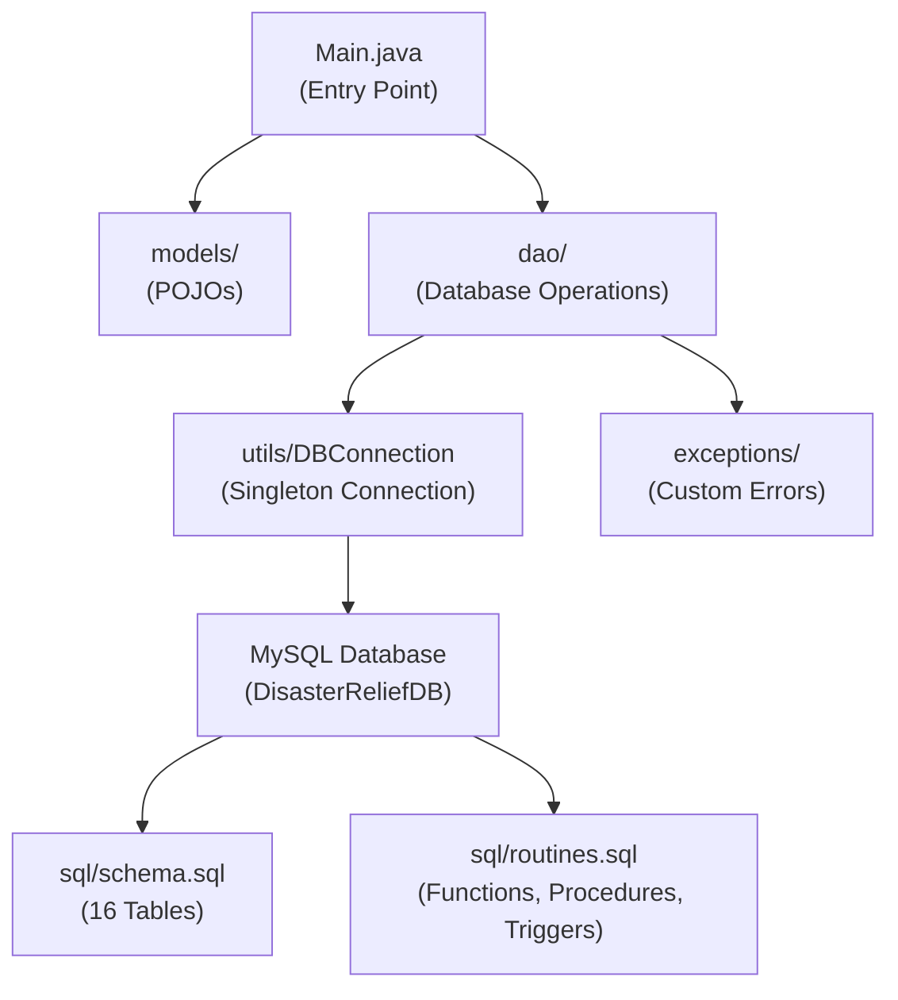
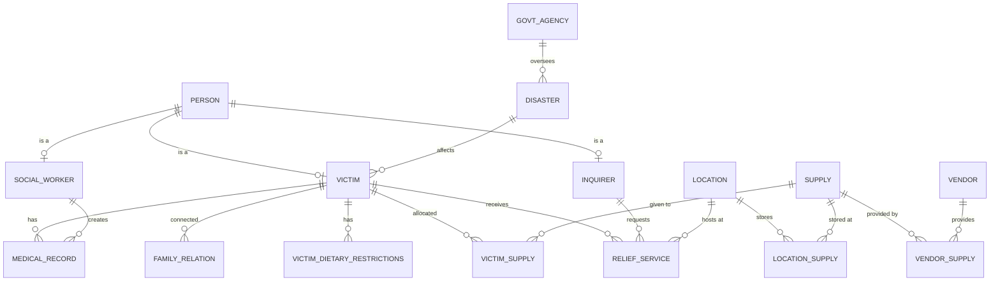
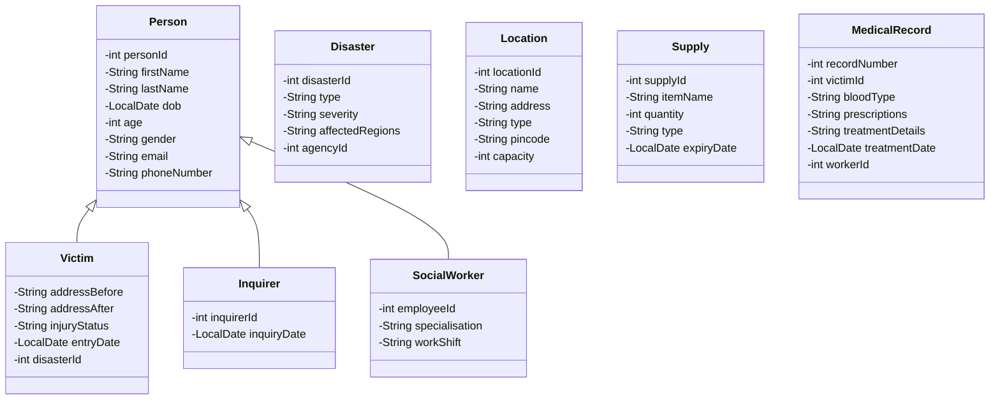

# Disaster Relief and Management System — Code Analysis

## Overview

This is a **Java + MySQL** console application that models a **disaster relief management system**. It manages victims, social workers, medical records, supplies, locations, and disasters — all backed by a normalized relational database (`DisasterReliefDB`). The project follows the **DAO (Data Access Object) pattern** for clean separation between models and database operations.

---

## Architecture

---

## Database Schema (16 Tables)

The database is well-normalized with proper foreign key relationships:

| Table | Purpose | Key Relationships |
|-------|---------|-------------------|
| `GOVT_AGENCY` | Government agencies overseeing response | — |
| `DISASTER` | Disaster events (type, severity, regions) | → `GOVT_AGENCY` |
| `PERSON` | Base table for all people (inheritance root) | — |
| `VICTIM` | Disaster victims with injury/address info | → `PERSON`, → `DISASTER` |
| `INQUIRER` | People inquiring about victims | → `PERSON` |
| `SOCIAL_WORKER` | Relief workers with specialisations | → `PERSON` |
| `FAMILY_RELATION` | Tracks family relationships between victims | → `VICTIM` × 2 |
| `MEDICAL_RECORD` | Treatment records for victims | → `VICTIM`, → `SOCIAL_WORKER` |
| `VICTIM_DIETARY_RESTRICTIONS` | Multi-valued dietary restrictions | → `VICTIM` |
| `LOCATION` | Relief centers, shelters, hospitals | — |
| `RELIEF_SERVICE` | Service interactions/inquiries | → `INQUIRER`, → `VICTIM`, → `LOCATION` |
| `VENDOR` | Supply vendors | — |
| `SUPPLY` | Relief supplies (food, medicine, etc.) | — |
| `LOCATION_SUPPLY` | Inventory at each location | → `LOCATION`, → `SUPPLY` |
| `VENDOR_SUPPLY` | Which vendor provides which supply | → `VENDOR`, → `SUPPLY` |
| `VICTIM_SUPPLY` | Supplies allocated to victims | → `VICTIM`, → `SUPPLY` |

### ER Relationship Diagram

---

## SQL Routines

### Functions
| Function | Purpose |
|----------|---------|
| `fn_calculate_age(dob)` | Dynamically computes age from DOB using `TIMESTAMPDIFF` |
| `fn_count_victims_in_camp(camp_name)` | Counts victims housed at a specific camp |

### Stored Procedures
| Procedure | Purpose |
|-----------|---------|
| `sp_insert_person(...)` | Inserts a person, auto-calculates age if DOB provided, returns generated ID via OUT param |
| `sp_register_victim(...)` | **Transactional** — inserts PERSON + VICTIM atomically |
| `sp_register_worker(...)` | **Transactional** — inserts PERSON + SOCIAL_WORKER atomically |
| `sp_allocate_victim_supply(...)` | Allocates supply to victim, checks stock, deducts inventory. Signals error if insufficient stock |

### Triggers
| Trigger | Purpose |
|---------|---------|
| `trg_update_global_supply_stock` | AFTER INSERT on `LOCATION_SUPPLY` → auto-updates global `SUPPLY.quantity` |
| `trg_validate_medical_date` | BEFORE INSERT on `MEDICAL_RECORD` → rejects future treatment dates |

---

## Java Layer

### Model Classes (`models/`)

Uses **inheritance** to model the `PERSON` supertype/subtype pattern:

> [!TIP]
> **Input validation** is baked into setter methods: `Location` validates type against an enum-like whitelist, validates pincode format (5-6 digits), and rejects non-positive capacity. `MedicalRecord` rejects future treatment dates. `Victim` and `Inquirer` reject null dates.

### DAO Classes (`dao/`)

Each DAO provides full **CRUD operations** via JDBC:

| DAO | Operations |
|-----|-----------|
| `VictimDAO` | `addVictim` (transactional PERSON+VICTIM insert), `getAllVictims`, `searchVictimsByName`, `updateInjuryStatus`, `deleteVictim` (transactional) |
| `WorkerDAO` | `addWorker` (transactional PERSON+WORKER insert), `getAllWorkers`, `updateWorkShift`, `deleteWorker` (transactional, resolves PERSON_ID first) |
| `SupplyDAO` | `addSupply`, `getAllSupplies`, `updateQuantity`, `deleteSupply` — uses `InvalidSupplyException` for negative quantities |
| `MedicalDAO` | `addMedicalRecord`, `getMedicalRecords` (by victim), `updateTreatment`, `deleteMedicalRecord` |
| `LocationDAO` | `addLocation`, `getAllLocations`, `updateCapacity`, `deleteLocation` |

> [!IMPORTANT]
> **Transaction safety**: `VictimDAO.addVictim()`, `VictimDAO.deleteVictim()`, `WorkerDAO.addWorker()`, and `WorkerDAO.deleteWorker()` all use manual transaction management (`setAutoCommit(false)` + `commit`/`rollback`) because they span multiple tables.

### Database Connection (`utils/DBConnection.java`)

- **Singleton pattern** — reuses a single static `Connection` object
- Connects to `jdbc:mysql://localhost:3306/DisasterReliefDB` with credentials `root` / `jeet123`
- Loads the MySQL JDBC driver explicitly via `Class.forName("com.mysql.cj.jdbc.Driver")`

### Custom Exceptions (`exceptions/`)

| Exception | Used By |
|-----------|---------|
| `VictimNotFoundException` | Not currently used in any DAO (reserved for future use) |
| `InvalidSupplyException` | Thrown by `SupplyDAO` when quantity is negative |

---

## Current State & Observations

> [!NOTE]
> **The `Main.java` is a stub** — it creates a mock `Victim` object but prints *"Victim initialized but DAO operations are removed"* without actually calling any DAO method. The system is structurally complete but has no working entry point to demonstrate the full flow.

### What's Complete ✅
- Full 16-table normalized database schema with FK constraints
- Server-side logic (functions, stored procedures, triggers)
- 8 model classes with validation
- 5 DAO classes with full CRUD and transaction management
- Singleton DB connection utility
- Custom exceptions

### What's Missing / Could Be Improved ⚠️
1. **No working `Main` method** — DAO calls are commented out / removed
2. **`interfaces/` package is empty** — was likely intended for DAO interfaces (e.g., `IVictimDAO`) but never implemented
3. **`VictimNotFoundException`** is declared but never thrown anywhere
4. **No build system** — no `pom.xml` (Maven) or `build.gradle` (Gradle); relies on IDE compilation
5. **Hardcoded DB credentials** — password exposed in source code
6. **The Java DAOs duplicate stored procedure logic** — e.g., `VictimDAO.addVictim()` manually inserts into PERSON + VICTIM, while `sp_register_victim` does the same thing server-side. Neither calls the other.
7. **No UI layer** — purely a backend/data-access project with no console menu, web interface, or API
